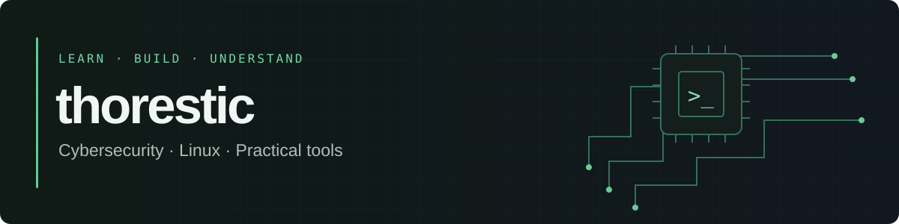

**Cybersecurity · Detail-oriented**

Cybersecurity learner focused on building practical skills step by step. Currently learning **Python** and **Linux**, and building projects, including Discord bots.

## Selected projects

- **[SSHGuard](https://github.com/thorestic/SSHGuard)** — A team-built SSH monitoring project with brute-force detection, temporary nftables blocking, and a monitoring dashboard.
- **[Thorestic Privacy Gateway](https://github.com/thorestic/thorestic-privacy-gateway)** — A Raspberry Pi gateway with a FastAPI dashboard, network controls, and English/Arabic documentation.
- **[IP-Tool](https://github.com/thorestic/IP-Tool)** — A Python/Tkinter desktop tool for IP lookup and authorized network scanning, with optional Nmap support.

## Certifications

- CompTIA A+
- CompTIA Network+
- CompTIA Server+
- EC-Council CSCU
- CCT
- ISC2 CC

## Focus

- Python & Linux fundamentals
- Cybersecurity basics + hands-on practice
- Discord bots, with more projects to come

## Tools & interests

Python · Linux · Raspberry Pi · Arduino · C++

## Currently learning

- Python (automation & tooling)
- Linux (terminal, system basics)
- More certifications (in progress)

## Links

- **Discord Server:** https://discord.gg/f9QwjMutPU

---

Minimal. Clean. Always learning.
